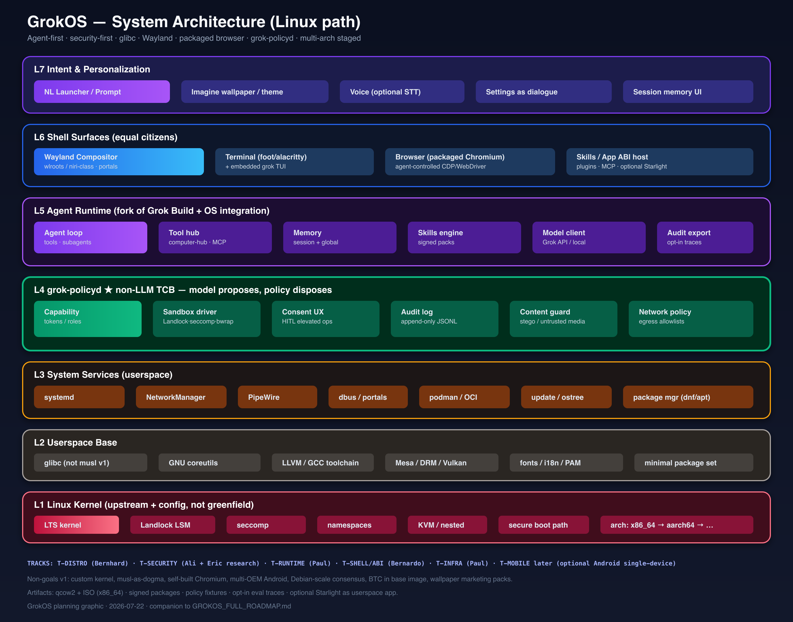

# GrokOS Full Technical Roadmap
## Linux-Based Agent-First Operating System

| Field | Value |
|-------|--------|
| **Document** | Master implementation roadmap |
| **Date** | 2026-07-22 |
| **Status** | Planning / pre-constitution |
| **Companion** | `GROKOS_REDTEAM_ANALYSIS.md` (if present), `planning/grokos-architecture.svg` |
| **System graphic** | [`grokos-architecture.svg`](./grokos-architecture.svg) · [`grokos-architecture.png`](./grokos-architecture.png) |
| **Working title** | GrokOS (legal-clearance pending; use codename until brand OK) |

---

## Table of contents

1. [Constitution & product definition](#1-constitution--product-definition)
2. [Team decisions locked from Slack](#2-team-decisions-locked-from-slack)
3. [System architecture (L1–L7)](#3-system-architecture-l1l7)
4. [Repository & monorepo layout](#4-repository--monorepo-layout)
5. [Technology bill of materials](#5-technology-bill-of-materials)
6. [Security architecture & threat model](#6-security-architecture--threat-model)
7. [Agent runtime integration](#7-agent-runtime-integration)
8. [Desktop / shell / personalization](#8-desktop--shell--personalization)
9. [Distribution, packages, updates](#9-distribution-packages-updates)
10. [Boot, install, images](#10-boot-install-images)
11. [Multi-arch matrix](#11-multi-arch-matrix)
12. [CI/CD, infra, hardware lab](#12-cicd-infra-hardware-lab)
13. [Testing strategy](#13-testing-strategy)
14. [Governance & process](#14-governance--process)
15. [Licensing & compliance](#15-licensing--compliance)
16. [Mobile track (deferred)](#16-mobile-track-deferred)
17. [Phased roadmap (P0–P9)](#17-phased-roadmap-p0p9)
18. [Work breakdown structure (WBS)](#18-work-breakdown-structure-wbs)
19. [Milestone gates & kill criteria](#19-milestone-gates--kill-criteria)
20. [Risk register](#20-risk-register)
21. [Resource model](#21-resource-model)
22. [Telemetry & model-feedback loop](#22-telemetry--model-feedback-loop)
23. [Documentation set](#23-documentation-set)
24. [Open decisions log](#24-open-decisions-log)
25. [Appendix: command recipes & references](#25-appendix-command-recipes--references)

---

## 1. Constitution & product definition

### 1.1 One-sentence thesis

**GrokOS is a security-first, agent-first Linux system where the model proposes actions and a non-LLM policy/sandbox layer disposes; the interaction surface (launcher, terminal, browser) is designed for agents as first-class principals.**

### 1.2 Non-goals (v1–v2 explicit)

| Non-goal | Why |
|----------|-----|
| Custom kernel from scratch | Driver wars; team size; no advantage vs upstream LTS |
| musl as identity | Bernhard: glibc wins on multi-core build perf + game/binary compat |
| Self-built Chromium | Update treadmill eats the project; package instead |
| Multi-OEM Android day one | Bernhard: no two devices alike; closed drivers; separate trees |
| Debian-scale consensus governance | Ali + Bernhard anti-pattern |
| BTC/Starlight in base image | Userspace app; security research separate |
| Wallpaper marketing packs | Ali: customize via prompt, not gallery marketing |
| “Replace macOS” | Scope fantasy; measure against Ubuntu + Grok Build instead |
| Cluster requirement | Paul: giant VMs + GPUs yes; free K8s cluster no |
| Another general-purpose distro archive | Eric: unified OSS mindshare > fragmentation; use existing distros for GPL commons |

### 1.3 Goals (ordered)

1. **Correctness of privilege boundary** — adversarial agent cannot silently escalate.
2. **Bootable, installable Linux** on x86_64 (QEMU + ≥1 bare metal).
3. **Agent-native UX** — NL launcher + terminal + browser with shared policy.
4. **Low-level performance path** — glibc, toolchain, selective optimization (Ali + Bernhard).
5. **Desktop experience** — opinionated minimal shell, not 400 DE packages.
6. **Reproducible images + CI** — every commit can produce a boot-tested artifact.
7. **Multi-arch expansion** — aarch64 → riscv64 → loongarch64 after x86_64 green.
8. **Optional mobile track** — single-device Android later (Bernhard: start one, bring other later).
9. **OSS showcase + Grok struggle traces** — dual mission for the org.

### 1.4 Success definition (12 months)

- Public or controlled-public **x86_64 ISO + qcow2** that boots, installs, runs agent under policy.
- **Security regression suite** green (stego, malicious skill, privilege prompts).
- **Daily dogfood** by ≥3 core developers for real work ≥1 day/week.
- Package set documented; update channel signed.
- Clear CODEOWNERS / BDFL map; monthly release cadence.

### 1.5 Codename policy

Until SpaceXAI/xAI brand counsel clears “GrokOS” / “Grok”:

- Internal: e.g. `aegis`, `helix`, `policylinux`, or `grokos-internal`.
- Public repos: avoid implying official xAI product without permission.
- Fork of Grok Build: retain Apache-2.0 notices; do not claim upstream endorsement.

---


### 1.6 Strategic constraint — avoid distro fragmentation (Eric C Yang, 2026-07-22)

> “When it's GPL licensed, the current distros work fine. I wouldn't build another one because it's better have unified mindshare for open source than fragmented.”

**Interpretation (planning):** Do **not** create a competing general-purpose Linux distribution brand that splits packagers, users, and security backports from Debian/Fedora/OpenMandriva/Arch/etc. GPL userspace is a solved commons; reinventing it loses mindshare.

**What this changes in the roadmap:**

| Was (aggressive distro reading) | Becomes (anti-fragmentation reading) |
|--------------------------------|--------------------------------------|
| New independent distro with own full package universe | **Edition / spin / image / overlay** on **one** existing well-known base |
| Compete for “which Linux?” mindshare | Compete on **agent + policy + shell** — the missing product |
| Own every package rebuild | Consume base distro packages; ship **delta only** (policyd, agent, session, skills, branding) |
| Long-term second Debian | Long-term **upstream to base** where possible; keep delta thin |

**What we still build (not “another distro” in Eric’s sense):**

1. **`grok-policyd` + sandbox** — net-new security product (can be packaged for multiple distros later).  
2. **Agent OS integration** — Grok Build fork wired to policy.  
3. **Opinionated session/shell** — Wayland session, NL launcher, Imagine personalization.  
4. **Reference images** — “GrokOS Desktop” as a **preconfigured image of BaseDistro**, not a fork of the entire archive.  
5. **Optional:** packaging scripts so Ubuntu/Fedora/OMV users install the same stack without our ISO.

**What we do *not* build:**

- Parallel glibc/coreutils/firefox rebuild universe “because we can.”  
- Unique ABI that traps users off the parent distro.  
- Marketing as “the new Linux” vs “agent-first layer + reference image.”

**Reconciles with Bernhard:** Distro craft still matters — kernel config fragments, image pipelines, multi-arch **on the chosen base**, optimization work, quality packaging of *our* packages — without declaring a new fractal distro. His multi-arch iron tests **images and packages**, not a greenfield archive.

**Reconciles with Ali:** Security-first agent boundary is **orthogonal** to inventing a package archive. Best security ROI is policyd + sandbox + signed skills on a maintained base that already gets CVEs fixed by thousands of people.

**Product naming implication:** Prefer “GrokOS” (or codename) as **product/edition** (“GrokOS on Fedora 42”, “GrokOS Session”) rather than “yet another `*buntu` clone.”

**ADR impact:** ADR-0001/0003 should explicitly choose **one parent distro** and state “we are an edition, not a fork of the archive.”

---

## 2. Team decisions locked from Slack

| Topic | Decision | Source |
|-------|----------|--------|
| Primary OS family | **Linux** (not Android-first) | Bernhard multi-device Android analysis; Paul concur |
| Android | **Useful later**, single-device if at all | Bernhard |
| libc | **glibc** (not musl) for perf + games/binary compat | Bernhard vs Eric’s musl sketch |
| Display | **Wayland** | Eric stack + modern default |
| Browser | **Packaged** Chromium or Firefox (pick one in P2) | Eric + roadmap guidance |
| Agent runtime | **Grok Build fork** + OS policy integration | Paul + inventory |
| Security | **First-class**; agents between user/kernel | Ali + Eric |
| Desktop personalization | **Prompt → Imagine** (or local gen), not wallpaper pack marketing | Bernhard + Ali |
| Imagine tutors on project | **Possible contributors**; official attach needs Paul ask | Paul |
| Optimization focus | **Low-level + desktop experience** early | Ali |
| Governance | **BDFL / small council**, anti-Debian | Ali + Bernhard |
| Distro fragmentation | **No new general-purpose distro archive**; edition/overlay on one base + ship delta packages | Eric |
| Tesla RT Linux | **Not a base** — GPL kernel tree is compliance artifact for cars, not a desktop distro starter; use **upstream Linux LTS** | Eric note clarified |
| Infra | Company giant VMs/GPUs; not free cluster | Paul |
| Starlight | Complementary app, not OS core | Bernhard + Eric |

### 2.1 BDFL seat proposal

| Seat | Domain | Candidate |
|------|--------|-----------|
| **BDFL-Distro** | Kernel config, packages, toolchain, multi-arch, release engineering | Bernhard Rosenkränzer |
| **BDFL-Security** | Threat model, policyd, sandbox, release security gates | Ali Akber Saifee |
| **BDFL-Runtime** | Agent loop, Grok Build fork, tools, MCP, memory | Paul Bergeron |
| **BDFL-Shell** | Compositor UX, launcher, app/skill ABI, desktop feel | Bernardo Ferrari |
| **Research (non-blocking)** | Stego, adversarial content, Starlight security demos | Eric C Yang |
| **Program / Infra** | Roadmap, GCP isolation, CI ownership, legal liaison | Paul Bergeron |

Cross-cutting changes: **2 of 3** Distro/Security/Runtime BDFLs must approve.

---

## 3. System architecture (L1–L7)



*Source: `planning/grokos-architecture.svg` (editable).*

### 3.1 Layer model

```
L7 Intent & personalization     NL launcher, Imagine themes, voice, dialogue settings
L6 Shell surfaces               Wayland compositor, terminal, browser, skill host
L5 Agent runtime                Grok Build fork: loop, tools, MCP, memory, model client
L4 grok-policyd ★ TCB           capabilities, sandbox, consent, audit, content guard, net policy
L3 System services              systemd, NM, PipeWire, dbus/portals, podman, updates, pkg
L2 Userspace base               glibc, coreutils, toolchain, Mesa, fonts, PAM, minimal set
L1 Linux kernel                 LTS + Landlock + seccomp + ns + KVM + secure boot path
```

**Hard rule:** L5 may not open a raw privileged syscall path that bypasses L4. L4 is implemented in Rust (or small C), audited, testable without an LLM.

### 3.2 Trust boundaries

| Boundary | Inside | Outside | Enforcement |
|----------|--------|---------|-------------|
| B0 Hardware | Firmware/SMM | OS | Secure boot optional v2 |
| B1 Kernel | Kernel + modules | Userspace | uid, capabilities, LSM |
| B2 Policy | grok-policyd + kernel helpers | Agent, browser, skills | Unix socket + MAC |
| B3 Session | User session | Network | nftables/egress profiles |
| B4 Content | Renderer sandbox | Untrusted files/images | landlock + no auto-exec |
| B5 Multi-tenant CI | Builder VM | Prod TeachX data | Separate GCP project |

### 3.3 Data flow: natural language action

```
User prompt
  → L7 launcher
  → L5 agent plans tool calls
  → each tool call → L4 PolicyRequest { principal, action, args, hash }
  → L4 evaluates: allow | deny | prompt_user | allow_sandboxed(profile)
  → on allow_sandboxed: spawn via bwrap/landlock/seccomp profile
  → stdout/stderr/artifacts streamed to L5
  → L4 appends AuditEvent
  → L5 synthesizes reply; optional memory write (also policy-gated)
```

### 3.4 Process model (session)

| Process | User | Notes |
|---------|------|-------|
| `systemd --user` | user | Session bus |
| `grokos-compositor` | user | Wayland |
| `grok-policyd` | `grok-policy` system user **or** root with seccomp | Prefer dedicated user + CAP_SYS_ADMIN only where required; design for least privilege |
| `grok-agent` | user | Unprivileged; talks to policyd |
| `foot` / terminal | user | Hosts TUI agent optionally |
| `chromium` | user | zygote sandbox; agent uses debug port only if policy allows |
| `podman` containers | user | Agent long-running jobs |

### 3.5 IPC

| Channel | Protocol | Auth |
|---------|----------|------|
| Agent ↔ policyd | Unix domain socket, length-prefixed JSON or capnp | SO_PEERCRED + token |
| Agent ↔ tools | computer-hub WebSocket / in-process | session bind |
| Compositor ↔ portals | xdg-desktop-portal | standard |
| Skills | on-disk signed tarball + manifest | cosign/minisign |

---

## 4. Repository & monorepo layout

### 4.1 Top-level org

Recommended Git org (GitHub or GitLab): `grokos-os` (or codename).

```
grokos/
├── README.md
├── CONSTITUTION.md
├── CODEOWNERS
├── LICENSE                    # Apache-2.0 for first-party; see docs/LICENSING.md
├── SECURITY.md
├── docs/
│   ├── architecture/
│   ├── threat-model/
│   ├── adr/                   # Architecture Decision Records
│   ├── runbooks/
│   └── roadmap/               # this doc lives / is mirrored here
├── kernel/
│   ├── configs/               # fragment configs per arch
│   ├── patches/               # empty preferred; minimize
│   └── README.md
├── distro/
│   ├── image/                 # image recipes (mkosi / kiwi / scripted)
│   ├── packages/              # SPECs or debian/ or rpm macros
│   ├── repos/                 # compose config
│   ├── kickstart/ or mkosi.default
│   └── rootfs-overlay/        # /etc defaults, units, branding
├── policyd/                   # ★ critical path Rust crate
│   ├── crates/grok-policyd
│   ├── crates/grok-policy-api
│   ├── crates/grok-sandbox-exec
│   └── fixtures/              # adversarial tests
├── agent/                     # fork of grok-build (or subtree)
│   ├── upstream-notes.md
│   ├── patches/
│   └── os-integration/
├── shell/
│   ├── compositor/            # config + optional custom shell chrome
│   ├── launcher/              # NL launcher
│   ├── personalization/       # Imagine wallpaper client
│   └── session/
├── abi/
│   ├── skill-manifest.schema.json
│   ├── app-sdk/               # Bernardo track
│   └── examples/
├── apps/                      # optional first-party
│   └── starlight-meta/        # packaging only, not submodule of BTC core
├── ci/
│   ├── build-image.yml
│   ├── boot-qemu.yml
│   ├── policy-tests.yml
│   └── supply-chain.yml
├── infra/
│   ├── terraform/             # isolated GCP project
│   ├── ansible/
│   └── packer/ or image scripts
└── tests/
    ├── boot/
    ├── security/
    ├── agent-e2e/
    └── perf/
```

### 4.2 CODEOWNERS (illustrative)

```
/distro/ /kernel/          @bdfl-distro
/policyd/ /tests/security/ @bdfl-security
/agent/                    @bdfl-runtime
/shell/ /abi/              @bdfl-shell
/ci/ /infra/               @program-infra
/docs/threat-model/        @bdfl-security @research-security
```

### 4.3 ADR process

Every irreversible choice gets `docs/adr/NNNN-title.md`:

- Status: proposed | accepted | superseded  
- Context, decision, consequences  
- Examples: glibc vs musl; mkosi vs Yocto; Chromium vs Firefox; ostree vs classic packages  

---

## 5. Technology bill of materials

### 5.1 Locked defaults (v1)

| Component | Choice | Rationale |
|-----------|--------|-----------|
| Kernel | **Linux LTS** (e.g. 6.12.x or current LTS at kickoff) | Stability; Landlock mature |
| libc | **glibc** | Bernhard: multi-core compile perf + binary/games compat |
| Init | **systemd** | Desktop reality; user sessions; portable services later |
| Display | **Wayland** only (XWayland allowed) | Eric stack; modern |
| Compositor | **wlroots-based** (Sway config *or* niri for scrollable/opinionated) | Small team; avoid GNOME/Plasma monolith v1 |
| Terminal | **foot** or **alacritty** | GPU-friendly, simple |
| Browser | **Distro Chromium** (or Firefox ESR) | Do not build from source v1 |
| Audio | **PipeWire** | Modern default |
| Network | **NetworkManager** | Desktop UX |
| Containers | **podman** rootless | Agent isolation without Docker daemon root |
| Sandbox | **Landlock + seccomp + namespaces + bubblewrap** | Aligns with grok-build `nono` / bwrap |
| Policy language | **JSON/CEL or custom Rust DSL** in policyd | Keep evaluable offline |
| Agent | **Fork xai-org/grok-build** (Apache-2.0) | Existing tools/sandbox/MCP |
| Pkg format v1 | **RPM** *or* **DEB** — **one** | Match Bernhard’s existing core; decide in P0 |
| Image build | **mkosi** (systemd ecosystem) *or* Bernhard’s existing pipeline | Prefer what BDFL-Distro already runs |
| Update v1 | Classic package repo + signed metadata | ostree/A/B optional v2 |
| Secure boot | Optional P2+ | Needs keys, shim, enrollment story |
| FS default | **btrfs** or **ext4** | btrfs if snapshots desired |
| Bootloader | **systemd-boot** (UEFI) + grub fallback | Simpler than full grub customization |

### 5.2 Rejected / deferred tech

| Tech | Status | Notes |
|------|--------|-------|
| musl | Deferred | Alpine containers OK; host glibc |
| Yocto full | Optional later | Heavy; overkill if desktop package-based |
| Buildroot | Optional appliance images | Tesla used for AP; not desktop |
| GNOME Shell | Deferred | Too large; not agent-first |
| Plasma full | Deferred | Bernhard likes quality Plasma but v1 minimal |
| Flatpak host | Optional P2 | Good for untrusted apps; policy integration needed |
| Nix | Research only | Powerful; steep for multi-BDFL |
| SELinux strict | Optional P3 | MLS complexity; AppArmor *or* SELinux pick one later |
| AppArmor | Candidate P2 | Easier profiles for agent binaries |
| Microkernels | Out | |

### 5.3 Kernel config fragments (minimum)

Must enable / verify:

```
CONFIG_SECURITY=y
CONFIG_SECURITY_LANDLOCK=y
CONFIG_SECCOMP=y
CONFIG_SECCOMP_FILTER=y
CONFIG_NAMESPACES=y
CONFIG_USER_NS=y
CONFIG_CGROUPS=y
CONFIG_BPF_SYSCALL=y
CONFIG_KVM=y                  # host testing / nested later
CONFIG_IKHEADERS or DWARF for tracing as needed
CONFIG_MODULE_SIG optional
```

Disable for reduced attack surface where possible: unused filesystems, rare drivers on cloud images (separate hardware profiles for bare metal).

### 5.4 Minimal package set (illustrative targets)

**Base image (~goal: boot + agent + browser + tools):**

- kernel, firmware set (image-specific)
- glibc, pam, shadow, systemd
- coreutils, util-linux, iproute2, iptables/nftables
- NetworkManager, mesa, seatd/elogind or systemd-logind
- wayland, wlroots compositor stack, xdg-desktop-portal-wlr
- foot, chromium (or firefox)
- podman, crun, slirp4netns, fuse-overlayfs
- openssh (optional server profile off by default)
- git, curl, ca-certificates, gnupg
- python3, rustc/cargo **only on -devel image**, not necessarily end-user ISO
- grok-policyd, grok-agent, grokos-launcher, grokos-session units

**Explicitly not in v1 ISO:** LibreOffice, full TeX, multiple browsers, games, GNOME, KDE mega-meta, BTC nodes.

---

## 6. Security architecture & threat model

### 6.1 Principals

| Principal | Authority |
|-----------|-----------|
| `user` | Normal desktop user |
| `agent:<id>` | Subordinate to user; never above |
| `skill:<hash>` | Code with declared permissions |
| `browser-renderer` | Highly sandboxed |
| `policyd` | Trusted computing base userspace |
| `root` / installers | Out of band; agent never silent-root |

### 6.2 Capability catalog (v1)

| Capability | Examples | Default agent |
|------------|----------|---------------|
| `fs.read` | workspace paths | allow listed roots |
| `fs.write` | workspace | allow listed |
| `fs.write_dotfiles` | `~/.config` | **prompt** |
| `proc.exec` | run binaries | allowlist + sandbox |
| `proc.exec_root` | package install | **prompt + polkit** |
| `net.llm` | api.x.ai | allow |
| `net.general` | arbitrary URL | profile-dependent |
| `net.bind` | listen ports | deny / prompt |
| `device.gpu` | compute | allow sandboxed |
| `device.camera_mic` | | **prompt** |
| `browser.control` | CDP | allow if user enabled |
| `secrets.read` | keyring | deny / prompt |
| `policy.self_modify` | | **deny always** |

### 6.3 Content trust (Eric stego class)

| Input type | Policy |
|------------|--------|
| Images | Decode in sandboxed process; **no** auto tool-exec from EXIF/LSB; optional stego scanner skill |
| Downloads | Quarantine dir; landlock; open via portal |
| Skills | Signature required for “trusted”; unsigned = max isolation + prompt |
| Clipboard | Treat as untrusted text |

### 6.4 Audit log schema (sketch)

```json
{
  "ts": "RFC3339",
  "event_id": "ulid",
  "principal": "agent:main",
  "action": "proc.exec",
  "argv_hash": "sha256...",
  "decision": "allow_sandboxed",
  "profile": "workspace-net-off",
  "user_prompted": false,
  "session_id": "...",
  "model_turn_id": "..."
}
```

Storage: append-only file under `/var/log/grokos/audit/` + optional user mirror `~/.local/share/grokos/audit/`.

### 6.5 Release security gates (blocking)

1. Policy unit tests pass  
2. Sandbox escape harness fails to escape (known techniques checklist)  
3. Malicious skill fixture denied  
4. Stego image fixture does not trigger silent exec  
5. SBOM generated; critical CVEs in base packages triaged  
6. Image signature verifies on clean installer  

### 6.6 Seccomp profiles

Ship named profiles:

- `agent-default`  
- `agent-no-net`  
- `agent-build` (compiler syscalls)  
- `skill-untrusted`  
- `content-decoder`  

Generate from allowlists; test with `libseccomp` tools.

---

## 7. Agent runtime integration

### 7.1 Relationship to Grok Build

| Item | Action |
|------|--------|
| Source | Periodic sync from `github.com/xai-org/grok-build` |
| License | Apache-2.0 compliance (NOTICE, attribution) |
| Contributions upstream | **Not accepted** by upstream — keep OS patches in `agent/os-integration` |
| Crates to lean on | sandbox, tools, shell, mcp, memory, plugin-marketplace, computer-hub |
| Binary name | `grok-agent` or `grokos-agent` (avoid trademark issues in branding) |

### 7.2 OS-specific patches (planned)

1. All privileged tool paths call policyd instead of direct escalation.  
2. Default workspace roots match GrokOS XDG layout.  
3. Systemd user unit: `grokos-agent.service`.  
4. Launch from NL launcher and from terminal identically.  
5. Browser tool uses system Chromium with policy-gated debugging.  
6. Memory dir: `~/.local/share/grokos/memory/`.  
7. Skills: `/usr/share/grokos/skills` + `~/.local/share/grokos/skills`.  

### 7.3 RAM reality (from GrokBox)

Grok CLI observed **8–30 GB RAM per heavy turn**. Desktop implications:

- Document **16 GB min**, **32 GB recommended** for agent-heavy use.  
- policyd enforces cgroup memory max per agent session (configurable).  
- Session killer / stale process reaper patterns from GrokBox ops.  

### 7.4 Offline / local model (optional P3)

- Slot for local OpenAI-compatible endpoint.  
- Policy identical; only transport changes.  
- Not required for v1 (cloud Grok OK).  

---

## 8. Desktop / shell / personalization

### 8.1 Design principles

1. **Prompt over panels** — settings and wallpaper via NL (Ali, Bernhard).  
2. **Terminal ≡ browser ≡ agent** — shared session identity.  
3. **Minimal chrome** — no marketing wallpaper pack.  
4. **Accessible** — keyboard-first; screen reader path tracked as P2.  

### 8.2 NL launcher (Alt+Space / Alt+F2 successor)

**Behaviors:**

- Empty → focus agent chat.  
- Shell-like string with leading `!` or detected binary → policy-gated exec.  
- Natural language → agent plan → policy → execute.  
- `wall: <description>` → Imagine/personalization client.  
- `theme: dark|light|…` → gsettings/file writes via policy.  

### 8.3 Imagine / look-and-feel track

| Item | Detail |
|------|--------|
| Wallpaper | User describes → API image → set via `swaybg`/`hyprpaper`/compositor wallpaper |
| Contributors | Grok Imagine tutors **if** policy allows (Paul to confirm official attach) |
| Fallback | Solid color + procedural gradient if no API key |
| Privacy | Images cached user-local; not uploaded except to Imagine API with consent |
| Non-goal | Shipping 50 stock wallpapers as product pitch |

### 8.4 Compositor choice matrix

| Option | Pros | Cons | v1 pick? |
|--------|------|------|----------|
| Sway | Stable, i3 model, docs | Tiling learning curve | Strong default |
| niri | Modern, scrollable, opinionated | Younger | Alternative |
| Custom Smithay | Full control Rust | DE engineering | P3+ only |
| KDE Plasma | Polished | Huge surface | Later optional spin |

**ADR required in P1.**

### 8.5 App / skill ABI (Bernardo track)

Phase alignment:

- **P2:** Skill manifest schema (permissions, entrypoint, signature).  
- **P3:** Stable host APIs: `grokos.fs`, `grokos.agent.invoke`, `grokos.ui.notify`.  
- **P4:** Optional Electron/Tauri host for rich apps without OpenCode breakage.  
- **Not v1:** Full app store with payments.  

---

## 9. Distribution, packages, updates

### 9.0 Anti-fragmentation rule (Eric)

Ship **delta packages + reference images** on a single parent. Measure success by “people run GrokOS session on $BASE,” not “$BASE is dead to us.” If the delta grows into a full fork archive, we have failed this constraint.


### 9.1 Strategy options (pick one in P0)

| Strategy | Description | Who it fits |
|----------|-------------|-------------|
| **A. Derivative** | Rebuild/overlay on OpenMandriva / Fedora / Debian | Fastest if Bernhard core exists |
| **B. Independent repo** | Own package set rebuilt from source | Max control; more labor |
| **C. Immutable** | ostree/bootc + containers for apps | Great updates; agent model fits; steeper |

**Recommendation (locked by §1.6):** **A only for v1–v2** — derivative/edition + overlay. **B (independent full repo)** is rejected as mindshare fragmentation unless BDFL-Distro proves the parent is unusable. **C (immutable ostree)** may still be an *update mechanism on top of A*, not a new distro war.

### 9.2 Package ownership

| Package | Owner |
|---------|-------|
| `grok-policyd` | Security |
| `grokos-agent` | Runtime |
| `grokos-launcher` | Shell |
| `grokos-session` | Shell + Distro |
| compositor meta | Shell + Distro |
| kernel package | Distro |

### 9.3 Signing

- Package metadata signed (GPG or sigstore).  
- Image digests in release notes.  
- Developer keys ≠ release keys.  
- HSM later; software keys in P1 with offline backup ceremony.

### 9.4 Update UX

- Agent can **propose** updates; cannot silent major upgrade without consent.  
- `grokos-update.timer` background metadata fetch.  
- Security updates: user prompt “apply 3 security updates?” with changelog summary (agent-written, policy-applied).  

---

## 10. Boot, install, images

### 10.1 Artifacts

| Artifact | Purpose |
|----------|---------|
| `grokos-YYYYMMDD-x86_64.qcow2` | QEMU/CI/cloud |
| `grokos-YYYYMMDD-x86_64.iso` | Bare metal install |
| `grokos-devel-...qcow2` | Compilers, headers, rustc |
| SBOM + `.sig` | Supply chain |
| `containers/agent-sandbox:tag` | Optional nested env |

### 10.2 Boot path (UEFI)

```
UEFI → systemd-boot → linux EFI stub → initramfs → systemd → graphical.target
  → grokos-session → compositor → policyd → welcome/agent
```

### 10.3 Installer

**v1:** Calamares **or** simple mkosi-built installer **or** scripted `grokos-install` for cloud images (growpart, user create).  

Cloud image: no installer; `cloud-init` or Ignition-like for SSH user.

### 10.4 First boot

1. Create user (if not present).  
2. Generate machine-id.  
3. Optional: enroll secure boot (P2).  
4. Prompt for Grok API key **or** device auth (browser).  
5. Write default policy profile “balanced”.  

---

## 11. Multi-arch matrix

| Arch | Phase | Hardware / CI | Notes |
|------|-------|---------------|-------|
| **x86_64** | P1 | GCE c3d, QEMU, Bernhard x86 | Primary |
| **aarch64** | P4 | Ampere Altra, GCE Tau/Axion if available, QEMU | Bernhard Altra |
| **riscv64** | P5 | Milk-V Pioneer ×3, QEMU | Expect pain |
| **loongarch64** | P6 | Loongson 3C6000 | Niche; prestige/portability |
| Android arm64 | P7+ | Single Pixel SKU only | Separate track |

Cross-compile: Bernhard toolchain expertise; CI uses native builders where possible (QEMU user-static as fallback).

---

## 12. CI/CD, infra, hardware lab

### 12.1 GCP isolation (mandatory)

| Item | Spec |
|------|------|
| Project | New: `grokos-ci` (name flexible) — **not** `teachx-data-platform` prod |
| Billing | Explicit budget alerts |
| IAM | Break-glass admin; builders as SAs |
| Secrets | Secret Manager; no TeachX Starfleet keys |
| Network | Private builders + Cloud NAT |
| Artifacts | GCS bucket `grokos-artifacts` lifecycle rules |

### 12.2 Builder sizing

| Role | Machine | Notes |
|------|---------|-------|
| Image build | c3d-standard-30 or n2-standard-32, 500GB–2TB SSD | Parallel package builds |
| Mass package (optional) | Time-slice c3d-standard-360 | GrokBox machine — schedule windows |
| QEMU boot tests | Nested virt **enabled** n2/c3 with `advancedMachineFeatures.enableNestedVirtualization=true` | Critical gap today on 360-box |
| GPU (optional) | T4/A100 | Stego models / local LLM experiments |
| Artifact cache | GCS + local NVMe | ccache, rustc cache |

### 12.3 Nested virtualization

**Action item P0:** Create test VM with nested virt; verify KVM inside guest; use for `boot-qemu` CI.  
Without it: TCG QEMU (slow) or Bernhard bare-metal boot farm.

### 12.4 Hardware lab (Bernhard)

| Machine | Role |
|---------|------|
| x86 boxes | Daily bare-metal |
| Ampere Altra | aarch64 reference |
| Milk-V Pioneer ×3 | riscv CI / community images |
| LoongArch 3C6000 | loongarch port |

Remote access: WireGuard/Tailscale mesh **separate** from TeachX production Tailscale if required by policy.

### 12.5 CI pipeline stages

```
lint → unit (policyd, agent) → package build → image build →
  qemu boot smoke → security fixtures → sign → publish artifacts
```

Timeouts: image build ≤ 2h target; boot smoke ≤ 10m.

### 12.6 Reuse GrokBox patterns

- Ephemeral contributor VMs for packaging workshops.  
- Memory reaper lessons for agent cgroups.  
- IAP/SSO for internal dogfood web entry (if any).  
- **Do not** run GrokOS CI inside student/tutor product paths.

---

## 13. Testing strategy

### 13.1 Pyramid

| Level | What | Gate |
|-------|------|------|
| Unit | Policy evaluation, path canonicalization, seccomp load | Every PR |
| Integration | policyd + fake agent over UDS | Every PR |
| Boot smoke | QEMU serial: login, `systemctl is-system-running`, agent --version | Every image |
| Security | Escape attempts, stego, malicious skill | Every release |
| Agent e2e | “create file”, “install htop” with prompts mocked | Nightly |
| Perf | Kernel compile wall time glibc host; boot time; RAM under agent | Weekly |
| Hardware | Bare metal matrix | Pre-release |

### 13.2 Security fixture catalog (seed)

1. Skill requests `policy.self_modify` → deny  
2. Image with embedded script in EXIF → no exec  
3. Agent proposes `chmod u+s` → prompt/deny  
4. Workspace breakout `../../etc/shadow` → deny  
5. Unexpected network to non-LLM endpoint in `agent-no-net` → kill  
6. Marketplace unsigned skill → isolation max  

### 13.3 Definition of “boots”

1. QEMU UEFI, 4 vCPU, 8 GB RAM, virtio disk  
2. Kernel + systemd reach `graphical.target` or `multi-user` + manual compositor start  
3. `grok-policyd` active  
4. Agent dry-run policy check returns allow for `echo`  
5. Serial console log captured as CI artifact  

---

## 14. Governance & process

### 14.1 Cadence

| Ritual | Frequency |
|--------|-----------|
| BDFL async standup | 2×/week |
| Architecture review | weekly 45m |
| Security review | weekly |
| Release | monthly after P2 |
| Constitution amend | rare; 3/4 BDFL |

### 14.2 Merge rules

- CODEOWNERS required reviews  
- `main` protected; signed tags for releases  
- No drive-by scope expansion without ADR  

### 14.3 Communication

- Private channel for core  
- Public Discord/Matrix later  
- ADRs in-repo are source of truth (not Slack)  

---

## 15. Licensing & compliance

### 15.1 Matrix

| Component | License | Obligation |
|-----------|---------|------------|
| Linux kernel | GPLv2 | Source offer for distributed binaries |
| glibc | LGPL | Dynamic link OK |
| systemd | LGPL | |
| Grok Build fork | Apache-2.0 | NOTICE file |
| First-party policyd/launcher | **Apache-2.0 recommended** | Simple for contrib |
| Chromium | BSD-style + patents | Ship licenses directory |
| Tesla Buildroot/Linux public trees | GPL artifacts for *their* products | **Do not** treat as GrokOS base; irrelevant except as industry precedent |

### 15.2 GPL compliance process

- Track all GPL packages in SBOM  
- `sources/` tarball or URL offer for each release  
- Script: `make license-check`  

### 15.3 Trademark

- Clear “GrokOS” with counsel before public launch  
- Avoid SpaceXAI logos without permission  
- xAI brand guidelines apply to “Grok” combinations  

---

## 16. Mobile track (deferred)

Bernardo’s Graphene-class idea; Bernhard’s constraints:

| Rule | Detail |
|------|--------|
| Start | **One** device SKU (e.g. specific Pixel) if ever |
| Not | Multi-OEM “runs on any phone” |
| Timing | After Linux x86_64 dogfood (P7+) |
| Agent | Privileged only as signed system app on **your** image |
| Relationship | Shared policy concepts; **not** shared codebase with desktop |

---

## 17. Phased roadmap (P0–P9)

Legend: **D**=Distro, **S**=Security, **R**=Runtime, **H**=Shell, **I**=Infra, **X**=Research

### P0 — Constitution & foundations (weeks 0–2)

**Exit:** Signed constitution; BDFL seats; ADR-0001 stack; isolated GCP project requested; name policy.

| ID | Task | Own | Deliverable |
|----|------|-----|-------------|
| P0.1 | Write/sign CONSTITUTION.md | All BDFL | File in repo |
| P0.2 | ADR-0001: glibc, systemd, Wayland, derivative base | D+R | ADR |
| P0.3 | ADR-0002: package format (RPM vs DEB) | D | ADR |
| P0.4 | ADR-0003: image tool (mkosi vs existing) | D | ADR |
| P0.5 | Threat model v0.1 | S+X | docs/threat-model/v0.1.md |
| P0.6 | GCP project + budgets | I | Project ID |
| P0.7 | Nested virt spike VM | I | Pass/fail report |
| P0.8 | Inventory Bernhard “core” (what exists today) | D | Gap analysis |
| P0.9 | Grok Build fork bootstrap | R | Repo + build CI |
| P0.10 | Legal: name + Imagine tutor attach + employee OSS | I/Paul | Written answers |
| P0.11 | Capability catalog v0 | S | YAML/JSON schema |
| P0.12 | Empty monorepo + CODEOWNERS + CI skeleton | I | Green pipeline |

### P1 — Vertical slice: policy + sandbox + fake agent (weeks 2–6)

**Exit:** policyd decides allow/deny/prompt; sandbox exec works on Ubuntu/Fedora host **and** prototype rootfs; unit tests green.

| ID | Task | Own | Deliverable |
|----|------|-----|-------------|
| P1.1 | `grok-policy-api` schema + Rust types | S | Crate |
| P1.2 | `grok-policyd` daemon UDS | S | Binary + unit |
| P1.3 | `grok-sandbox-exec` Landlock+bwrap launcher | S+R | Binary |
| P1.4 | seccomp profiles v0 | S | Profiles |
| P1.5 | Consent TUI/CLI prompt | H+S | UX stub |
| P1.6 | Audit log writer | S | JSONL |
| P1.7 | Fake agent client (no LLM) exercising policy | R | Integration test |
| P1.8 | Content decoder sandbox stub | X+S | Fixture pass |
| P1.9 | Host CI for policyd | I | GitHub/GitLab CI |

### P2 — Bootable image x86_64 (weeks 5–12)

**Exit:** qcow2 boots in QEMU to compositor + policyd + agent connected to real Grok API (optional key).

| ID | Task | Own | Deliverable |
|----|------|-----|-------------|
| P2.1 | Base rootfs from derivative | D | Recipe |
| P2.2 | Kernel package + config fragments | D | Bootable kernel |
| P2.3 | Overlay: units, configs, branding | D+H | overlay/ |
| P2.4 | Package policyd + agent into distro packages | D+R+S | .rpm/.deb |
| P2.5 | Session scripts: start compositor+agent | H | working session |
| P2.6 | Packaged browser install | D | chromium in image |
| P2.7 | NL launcher v0 (CLI → agent) | H+R | binary |
| P2.8 | Image build pipeline | I+D | CI artifact |
| P2.9 | QEMU boot smoke CI | I | gate |
| P2.10 | cloud-init/SSH profile for dogfood VMs | I | docs |
| P2.11 | ADR-0004: compositor choice | H | ADR |
| P2.12 | First internal dogfood week | All | notes |

### P3 — Security hardening + agent OS tools (weeks 10–16)

**Exit:** Release security gates automated; agent can do real desktop tasks under policy.

| ID | Task | Own |
|----|------|-----|
| P3.1 | Full capability coverage for agent tools | S+R |
| P3.2 | Browser control tool policy-gated | R+H |
| P3.3 | Package install tool (prompted) | R+D |
| P3.4 | Malicious skill + stego CI suite | S+X |
| P3.5 | cgroup memory limits per agent | R+I |
| P3.6 | SBOM + `license-check` | D+I |
| P3.7 | Signed packages | D |
| P3.8 | Personalization: Imagine wallpaper client | H |
| P3.9 | Skill manifest schema v1 | H+R |
| P3.10 | Audit log viewer (CLI) | S |

### P4 — Desktop experience + aarch64 (weeks 14–22)

**Exit:** Daily-drivable x86; aarch64 image boots on Altra or QEMU.

| ID | Task | Own |
|----|------|-----|
| P4.1 | Launcher polish, keybindings, theming via prompt | H |
| P4.2 | Portals (file picker, screencast) for agent | H |
| P4.3 | Network manager UX via agent | R+H |
| P4.4 | aarch64 bootstrap | D |
| P4.5 | glibc/toolchain optimization experiments documented | D |
| P4.6 | ISO installer path | D |
| P4.7 | Accessibility spike | H |
| P4.8 | Dogfood on Bernhard bare metal | D |

### P5 — Multi-arch riscv + ABI + optional ostree spike (weeks 20–28)

| ID | Task | Own |
|----|------|-----|
| P5.1 | riscv64 bring-up Milk-V | D |
| P5.2 | App/skill SDK v0 | H |
| P5.3 | Plugin marketplace mirror (OS skills) | R |
| P5.4 | ostree/bootc experiment (non-default) | D |
| P5.5 | Performance benchmarks published | D+R |

### P6 — loongarch + public alpha readiness (weeks 26–34)

| ID | Task | Own |
|----|------|-----|
| P6.1 | loongarch64 experimental image | D |
| P6.2 | Public docs site | I |
| P6.3 | Name clearance → branding | I |
| P6.4 | Alpha ISO public or waitlist | All |
| P6.5 | Community contribution guide | All |
| P6.6 | Starlight packaging guide (userspace) | X |

### P7 — Mobile spike optional (weeks 32–40)

Single-device Android research ROM **or** stop. Does not block desktop.

### P8 — Hardening year-1 (months 9–12)

Secure boot story, AppArmor/SELinux decision, Flatpak integration, enterprise update channel, formal pen-test.

### P9 — Sustainability

Fund/entity decision, conference talks, partnership (OEM/SBC), long-term BDFL succession.

---

## 18. Work breakdown structure (WBS)

```
1. Program
   1.1 Constitution & legal
   1.2 Governance tooling
   1.3 Roadmap maintenance
2. Distro
   2.1 Kernel packaging
   2.2 Rootfs/image
   2.3 Package repo
   2.4 Installer
   2.5 Multi-arch
   2.6 Performance
3. Security
   3.1 Threat model
   3.2 policyd
   3.3 Sandbox profiles
   3.4 Audit
   3.5 Content guards
   3.6 Release gates
4. Runtime
   4.1 Grok Build fork
   4.2 OS integration
   4.3 Tools policy wiring
   4.4 Memory paths
   4.5 Telemetry export
5. Shell
   5.1 Compositor session
   5.2 Launcher
   5.3 Personalization
   5.4 ABI/SDK
6. Infra
   6.1 GCP project
   6.2 CI pipelines
   6.3 Nested virt
   6.4 Artifact signing automation
   6.5 Hardware lab net
7. Research
   7.1 Stego fixtures
   7.2 Adversarial agent corpus
   7.3 Starlight as app
```

---

## 19. Milestone gates & kill criteria

### 19.1 Go gates

| Gate | When | Criteria |
|------|------|----------|
| G0 | End P0 | Constitution signed; BDFL yes; ADR-0001; legal name policy |
| G1 | End P1 | policyd + sandbox tests green on host |
| G2 | End P2 | QEMU image boots; agent hello-world under policy |
| G3 | End P3 | Security suite green; internal dogfood ≥2 weeks |
| G4 | End P4 | aarch64 boots; ISO installs on one bare metal |
| G5 | Alpha | Name cleared or codename public; signed images |

### 19.2 Kill / pivot criteria

| Trigger | Action |
|---------|--------|
| No bootable image by **week 14** | Pivot to “GrokOS Runtime on Ubuntu” only |
| BDFLs cannot agree on libc/base by week 2 | Pause |
| Security gate repeatedly waived | Stop public claims; re-scope |
| Company forbids infra isolation | Personal/Bernhard lab only or halt |
| Legal forbids all Grok branding and API terms block OS use | Redesign around multi-model |
| Team < 2 active engineers for 6 weeks | Archive |

---

## 20. Risk register

| ID | Risk | L | I | Mitigation |
|----|------|---|---|------------|
| R1 | Vision soup returns | H | H | Constitution + BDFL |
| R2 | Trademark | M | H | Codename; counsel |
| R3 | Fork rot vs grok-build | H | M | Monthly rebase job |
| R4 | Nested virt unavailable | M | M | Bernhard QEMU; enable GCE flag |
| R5 | Agent RAM OOMs | H | M | cgroups; docs; reaper |
| R6 | Browser update CVE lag | H | H | Distro security tracking |
| R7 | Scope: full DE | M | H | wlroots minimal only |
| R8 | Android distraction | M | M | Explicit P7+ only |
| R9 | GPL compliance miss | L | H | SBOM automation |
| R10 | Policyd bypass bug | M | C | Fuzz; bounty later; least privilege |
| R11 | Key person (Bernhard) bus factor | M | H | Document pipelines; second packager trainee |
| R12 | Imagine API / tutor attachment denied | L | L | Procedural wallpapers; solid colors |
| R13 | Contended 360-core VM | M | M | Dedicated mid builders |
| R14 | Supply chain malicious skill | M | H | Signatures; defaults deny |

---

## 21. Resource model

### 21.1 People (steady state after P0)

| Role | FTE equivalent | Notes |
|------|----------------|-------|
| Distro | 0.5–1.0 | Bernhard-led |
| Security | 0.5 | Ali-led |
| Runtime | 0.5 | Paul-led |
| Shell | 0.3–0.5 | Bernardo-led |
| Infra | 0.2 | Paul |
| Research | 0.2 | Eric optional |
| Contributors | variable | Imagine tutors if allowed |

### 21.2 Compute (monthly rough)

| Resource | Est. |
|----------|------|
| n2/c3 builder 32 vCPU | always-on or scheduled |
| Nested virt test VM | always-on small |
| Artifact storage | 1–5 TB GCS |
| GPU | on-demand |
| API costs (Grok) | dogfood + CI synthetic |

### 21.3 Hardware budget

Pixels only if mobile track; otherwise Bernhard lab + cloud.

---

## 22. Telemetry & model-feedback loop

Dual mission: improve Grok on real OS tasks.

| Mechanism | Privacy |
|-----------|---------|
| Opt-in `grokos-eval-donate` | User reviews redacted traces |
| Public task suite | Install pkg, fix net, refuse stego — scored |
| Local audit always on | Never leaves machine by default |
| CI synthetic tasks | No user data |

**Forbidden:** silent desktop exfiltration; harvesting without consent.

---

## 23. Documentation set

| Doc | Owner | When |
|-----|-------|------|
| CONSTITUTION.md | All | P0 |
| Architecture | Runtime+Distro | P1 |
| Threat model | Security | P0–P3 |
| ADRs | Authors | ongoing |
| Install guide | Distro | P2 |
| Policy author guide | Security | P3 |
| Skill developer guide | Shell | P3 |
| Contributor guide | Program | P6 |
| Hardware enablement | Distro | P4+ |
| Incident response | Security | P3 |

---

## 24. Open decisions log

| # | Decision | Options | Deadline | Decider |
|---|----------|---------|----------|---------|
| OD1 | Public name | GrokOS vs codename | Before public alpha | Legal+Paul |
| OD2 | RPM vs DEB | | P0 | BDFL-Distro |
| OD3 | Base derivative | OMV / Fedora / Debian / other | P0 | BDFL-Distro |
| OD4 | Compositor | sway vs niri | P1 | BDFL-Shell |
| OD5 | Browser | Chromium vs Firefox | P2 | Shell+Security |
| OD6 | policyd privilege model | root vs CAP vs user ns | P1 | Security |
| OD7 | Imagine official tutors | yes/no | P0 | Paul/org |
| OD8 | Immutable updates | classic vs ostree | P5 experiment | Distro |
| OD9 | MAC | AppArmor vs SELinux vs none v1 | P3 | Security |
| OD10 | Init (reconfirm) | systemd only | P0 | Distro |

---

## 25. Appendix: command recipes & references

### 25.1 Nested virt GCE (sketch)

```bash
gcloud compute instances create grokos-nested-test \
  --project=grokos-ci \
  --zone=us-central1-a \
  --machine-type=n2-standard-16 \
  --enable-nested-virtualization \
  --create-disk=auto-delete=yes,boot=yes,size=200,type=pd-ssd,image-family=debian-12,image-project=debian-cloud
# Inside: install qemu-kvm; verify /dev/kvm
```

### 25.2 QEMU boot smoke (sketch)

```bash
qemu-system-x86_64 -enable-kvm -m 8192 -smp 4 \
  -drive file=grokos.qcow2,if=virtio \
  -netdev user,id=n0 -device virtio-net-pci,netdev=n0 \
  -nographic -serial mon:stdio
```

### 25.3 Policy check (sketch)

```bash
grok-policy-cli check --principal agent:main \
  --action proc.exec --arg /usr/bin/htop
```

### 25.4 Key upstream references

- Linux kernel: https://kernel.org  
- Landlock: kernel docs `userspace-api/landlock`  
- systemd / mkosi: https://github.com/systemd/mkosi  
- Wayland / wlroots: https://gitlab.freedesktop.org/wlroots/wlroots  
- Grok Build: https://github.com/xai-org/grok-build  
- GrapheneOS (mobile later contrast): https://grapheneos.org  
- Tesla GPL release precedent: github.com/teslamotors/{linux,buildroot} — **compliance reference only**  
- ChromeOS Crostini/Sommelier (browser-OS lessons): chromium.googlesource.com  

### 25.5 Mapping team assets → roadmap

| Asset | Roadmap use |
|-------|-------------|
| grok-build | agent/ fork |
| GrokBox | CI contributor envs; RAM ops lessons |
| hyperspace skills layout | /usr/share/grokos/skills design |
| rlm-harness | optional long-log agent mode |
| currents | future resource governor research |
| Bernhard core + iron | distro/ + multi-arch |
| Starlight/Stargate | apps packaging P6 |
| agent-board lessons | abi/ P5 |
| teachx GCP | patterns only; new project for CI |

### 25.6 Suggested first 10 ADRs

1. glibc over musl  
2. Package format  
3. Image builder  
4. Compositor  
5. Browser packaging  
6. Policy IPC format  
7. Derivative base distro  
8. Update mechanism v1  
9. Skill signing scheme  
10. Telemetry ethics  

---

## 26. Executive timeline (one page)

```
Week 0-2    P0  Constitution, ADRs, GCP, fork, threat model
Week 2-6    P1  policyd + sandbox + tests
Week 5-12   P2  First bootable x86_64 image + agent
Week 10-16  P3  Security suite + real tools + Imagine wallpaper
Week 14-22  P4  Desktop polish + aarch64
Week 20-28  P5  riscv + ABI SDK
Week 26-34  P6  loongarch experimental + public alpha
Week 32-40  P7  Optional single-device Android spike
Month 9-12  P8  Hardening, secure boot, pen-test
```

---

## 27. Immediate next actions (this week)

1. **Schedule 90-minute constitution meeting** with proposed BDFLs; sign CONSTITUTION.md.  
2. **Paul:** legal questions — name, Imagine tutors, employee OSS IP.  
3. **Bernhard:** dump notes on existing core (packages, build host, image path).  
4. **Ali:** expand threat model outline from §6.  
5. **Paul/Infra:** open `grokos-ci` project + nested virt spike.  
6. **Runtime:** private fork of grok-build; document delta process.  
7. **Do not:** start Android, musl host, or Chromium from-source builds.  

---

*End of master roadmap. Architecture graphic: `planning/grokos-architecture.{svg,png}`. Red-team companion: `GROKOS_REDTEAM_ANALYSIS.md`.*
